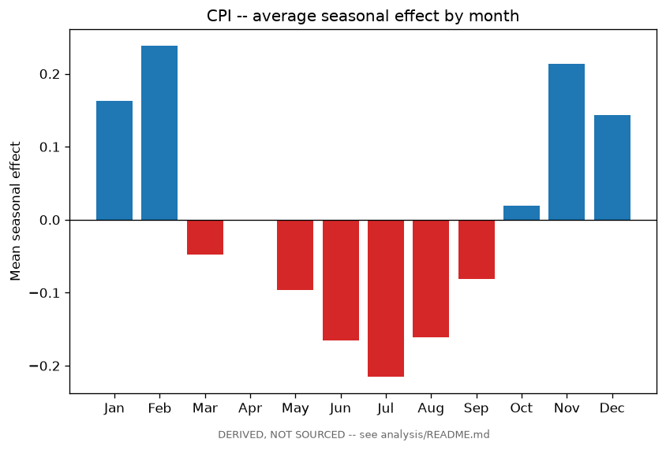
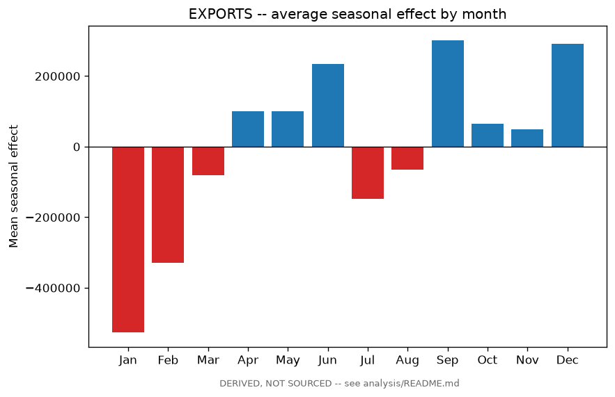
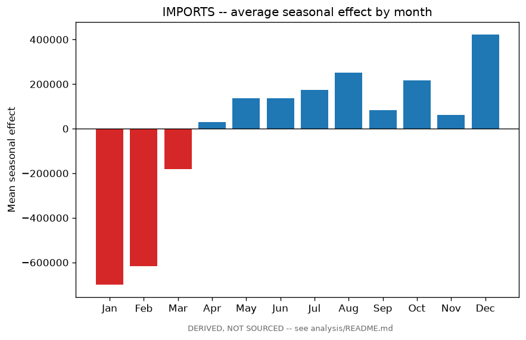
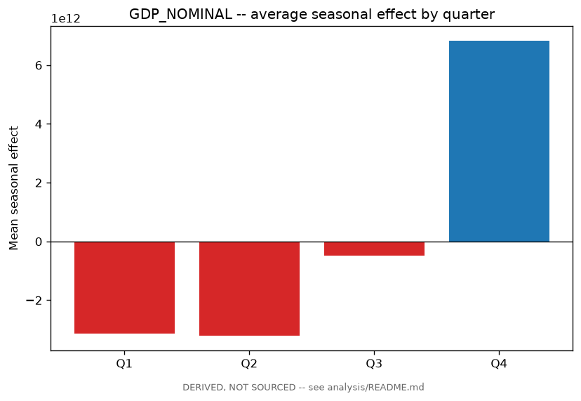

# Seasonal decomposition -- 2026-09-28

**DERIVED, NOT SOURCED.** Every number below is computed by
`scripts/decompose_seasonality.py` from `data/unified/macro_long.csv`. None of
it is published by БНС, НБ РК, Минфин, АРРФР, or the IMF; it does not belong
in `config/indicators.yaml`, `data/processed/`, or the sourced-data narrative
in `project_knowledge/`, and as of this report it is not synced into the
Claude Project. Treat every figure here as a starting point for a question,
not a finding on its own -- see Methodology and limitations at the end.

Curated set of 4 targets, hand-picked for having enough dense, gap-free history to make a seasonal decomposition meaningful, and being genuinely seasonal in the classic sense -- not every monthly/quarterly indicator in the dataset. See `analysis/README.md` for the full feasibility sweep and why the rest were left out.

## CPI

**Headline CPI, month-over-month (already a comparison index)**

*Why this candidate:* Already a published MoM comparison index (observation_type=comparison_index, comparison_basis=mom, unit 'index, previous month = 100') -- decompose as published, same 'already a comparison, don't transform it' rule scripts/analysis/correlate.py already uses. Textbook seasonal candidate: 187 gap-free monthly points (2011-01..2026-07), 15.5x this pass's 3-cycle minimum.

- Prepared as: sample from 2011-01-01; verified gap-free on a regular calendar grid; level as published (no growth-rate transform)
- Method: X-13 X-11 -- log; (1 0 0)(0 0 1); calendar: none kept; outliers: LS2011.Mar, TC2014.Feb, TC2015.Oct, TC2015.Dec, AO2017.Oct, AO2022.Mar, TC2022.Mar, TC2022.Sep, LS2024.Oct; M7 0.73; Q 1.17.
- Window: 2011-01-01 .. 2026-08-01 -- 188 observations, period=12 (monthly).
- **Seasonal strength: 0.131** (0-1 scale; see Methodology for the formula).
- Trend: 101.51 -> 100.80 (fell, 0.7% over the window).

Window includes the 2022 KZT devaluation's inflation spike and the 2020 COVID disruption -- both large, transient, non-seasonal shocks. robust=True exists specifically so neither distorts the seasonal estimate for the calendar month it happened to land in, rather than the shock's size being permanently attributed to that month every year.

**Average seasonal effect by calendar month:**

| Period | Mean seasonal factor | Mean seasonal effect | Cycles averaged |
|---|---|---|---|
| Jan | +0.16% | +0.16 | 16 |
| Feb | +0.24% | +0.24 | 16 |
| Mar | -0.05% | -0.05 | 16 |
| Apr | -0.00% | +0.00 | 16 |
| May | -0.10% | -0.10 | 16 |
| Jun | -0.16% | -0.17 | 16 |
| Jul | -0.21% | -0.22 | 16 |
| Aug | -0.16% | -0.16 | 16 |
| Sep | -0.08% | -0.08 | 15 |
| Oct | +0.02% | +0.02 | 15 |
| Nov | +0.21% | +0.21 | 15 |
| Dec | +0.14% | +0.14 | 15 |

## EXPORTS

**Exports (total), monthly level**

*Why this candidate:* Raw monthly trade-flow level (thousand USD, observation_type=period_total, no cumulation) -- decompose the level, not a growth rate: the decomposition separates trend/seasonal/residual out of the level itself, and a growth-rate series would already be partially deseasonalized before the decomposition ever saw it. 90 gap-free monthly points (2019-01..2026-06), 7.5x the minimum -- shorter margin than CPI, still comfortable.

- Prepared as: verified gap-free on a regular calendar grid; level as published (no growth-rate transform)
- Method: X-13 X-11 -- none; (0 1 1)(0 1 1); calendar: kzwd(t=0.3)+kurban(t=-1.6); outliers: AO2019.Mar, LS2026.Jun; M7 1.03; Q 0.87.
- Window: 2015-01-01 .. 2026-07-01 -- 139 observations, period=12 (monthly).
- **Seasonal strength: 0.463** (0-1 scale; see Methodology for the formula).
- Trend: 4,065,365.80 -> 9,821,300.13 (rose, 141.6% over the window).

Same COVID/devaluation shock-window caveat as CPI. Also exposed to global commodity-price swings unrelated to calendar seasonality -- a real seasonal signal here more plausibly reflects shipment/logistics timing than price.

**Average seasonal effect by calendar month:**

| Period | Mean seasonal effect | Cycles averaged |
|---|---|---|
| Jan | -526,127.86 | 12 |
| Feb | -328,253.89 | 12 |
| Mar | -80,095.46 | 12 |
| Apr | +100,402.89 | 12 |
| May | +101,361.22 | 12 |
| Jun | +234,669.90 | 12 |
| Jul | -148,377.78 | 12 |
| Aug | -65,171.12 | 11 |
| Sep | +301,410.18 | 11 |
| Oct | +64,856.68 | 11 |
| Nov | +49,028.54 | 11 |
| Dec | +291,083.20 | 11 |

## IMPORTS

**Imports (total), monthly level**

*Why this candidate:* Same construction as EXPORTS (thousand USD, period_total, no cumulation, 90 gap-free points 2019-01..2026-06) -- run alongside it, not instead of it: imports and exports can carry different seasonal patterns (domestic demand timing vs. what Kazakhstan exports).

- Prepared as: verified gap-free on a regular calendar grid; level as published (no growth-rate transform)
- Method: X-13 X-11 -- log; (0 1 1)(0 1 1); calendar: kzwd(t=7.3)+kurban(t=-0.5); outliers: none; M7 0.43; Q 0.42.
- Window: 2015-01-01 .. 2026-07-01 -- 139 observations, period=12 (monthly).
- **Seasonal strength: 0.877** (0-1 scale; see Methodology for the formula).
- Trend: 2,844,394.32 -> 5,280,325.00 (rose, 85.6% over the window).

Same COVID/devaluation and price-vs-timing caveat as EXPORTS.

**Average seasonal effect by calendar month:**

| Period | Mean seasonal factor | Mean seasonal effect | Cycles averaged |
|---|---|---|---|
| Jan | -19.27% | -699,438.24 | 12 |
| Feb | -17.52% | -617,815.12 | 12 |
| Mar | -5.44% | -180,084.77 | 12 |
| Apr | +0.41% | +28,615.79 | 12 |
| May | +3.94% | +137,387.66 | 12 |
| Jun | +3.42% | +136,408.73 | 12 |
| Jul | +4.78% | +172,886.17 | 12 |
| Aug | +7.84% | +250,501.87 | 11 |
| Sep | +2.93% | +82,543.69 | 11 |
| Oct | +6.33% | +217,850.49 | 11 |
| Nov | +1.35% | +61,306.60 | 11 |
| Dec | +11.25% | +422,265.68 | 11 |

## GDP_NOMINAL

**Nominal GDP, quarterly level (de-cumulated)**

*Why this candidate:* cumulation=year_to_date -- runs through scripts.lib.transformations.decumulate_ytd before decomposition (via timeseries.prepare_level), then decomposes the de-cumulated own-period level as published. 66 gap-free quarterly points (2010-01..2026-04), 16.5x the minimum -- the deepest margin of the four candidates.

- Prepared as: de-cumulated (year-to-date total -> own-period contribution); verified gap-free on a regular calendar grid; level as published (no growth-rate transform)
- Method: X-13 X-11 -- log; (1 1 0)(0 1 1); calendar: none kept; outliers: LS2020.2; M7 0.11; Q 0.19.
- Window: 2010-01-01 .. 2026-04-01 -- 66 observations, period=4 (quarterly).
- **Seasonal strength: 0.996** (0-1 scale; see Methodology for the formula).
- Trend: 4,935,134,795,659.40 -> 45,348,545,739,079.20 (rose, 818.9% over the window).

Nominal KZT GDP grew roughly an order of magnitude over this window from real growth, inflation, and the 2022 devaluation combined -- trend dominates the raw level's variance by construction, which is exactly why seasonal strength is reported as a share of seasonal-plus-residual variance, not total variance (see the report's Methodology section).

**Average seasonal effect by calendar quarter:**

| Period | Mean seasonal factor | Mean seasonal effect | Cycles averaged |
|---|---|---|---|
| Q1 | -17.64% | -3,139,998,354,360.79 | 17 |
| Q2 | -15.83% | -3,208,914,668,702.11 | 17 |
| Q3 | -1.23% | -496,065,096,770.01 | 16 |
| Q4 | +34.73% | +6,828,328,014,847.82 | 16 |

## Methodology and limitations

- Decomposition is X-13ARIMA-SEATS (US Census Bureau, version 1.1 build 62,
  driven by `scripts/lib/x13.py`): a regARIMA model with the ARIMA orders
  chosen automatically (automdl), automatic additive-outlier / level-shift /
  temporary-change detection, the log-vs-level choice made by AICC, and the
  Kazakhstan calendar -- a working-day count under the holiday law (weekend
  holidays moved to the next working day; Kurban Ait and Orthodox Christmas
  not moved) plus a Kurban Ait month regressor -- kept only when AICC prefers
  it; then the X-11 filters give the seasonal factors (table D10), the
  trend (D12) and the irregular (D13). The regARIMA outliers keep the 2020
  COVID disruption and the 2022 KZT devaluation out of the seasonal factors,
  the job STL's robust weights did before. M7 and Q below 1 are X-11's own
  acceptance thresholds for an identifiable, stable seasonal pattern.
- In a multiplicative (log) adjustment the table shows both the mean seasonal
  factor (% above or below the trend-level) and the effect in the series' own
  units, SA x (factor - 1), averaged over the years; in an additive one only
  the latter. X-13's seasonal effect is net of the calendar effects it
  removes separately.
- STL (`statsmodels.tsa.seasonal.STL`, `robust=True`) is the fallback: used
  for a target only when no X-13 binary is available or X-13 rejects the
  series, and then the target's section says so.
- Every target is required to clear 3 full seasonal cycles of
  history before decomposition runs at all (X-13's own minimum; stricter than
  STL's documented ~2-cycle minimum) -- refused, not attempted with a louder
  caveat, below that bar.
- **Seasonal strength** is `max(0, 1 - Var(resid)/Var(seasonal+resid))` (the
  standard Hyndman & Athanasopoulos measure), not `Var(seasonal)/Var(original)`,
  computed on logs for a multiplicative adjustment. The difference matters for
  a strongly-trending series: the naive ratio would be dominated by trend and
  understate seasonality. 0 means the seasonal component explains nothing
  beyond noise; 1 means the residual is negligible next to it.
- The trend (X-11 Henderson filter or STL's LOESS) is less reliable at the very
  start and end of the window than in the middle (X-13 extends the series with
  ARIMA forecasts, STL does not) -- the reported trend start/end values inherit
  that edge effect and should be read as approximate, not exact boundary values.
- This is a curated set of hand-picked targets, not every monthly/quarterly
  indicator in the dataset -- see `analysis/README.md` for the full
  feasibility sweep and why the rest were left out.
