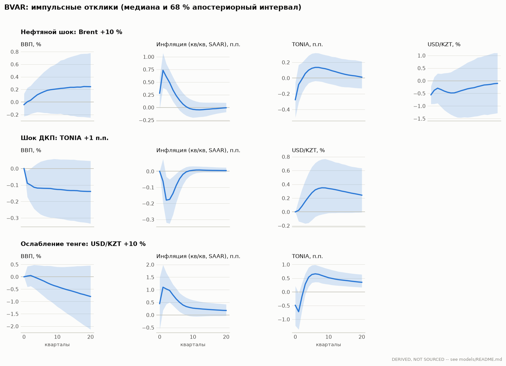
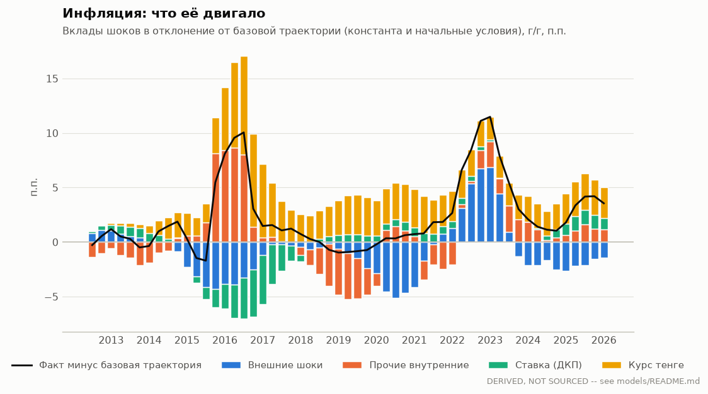
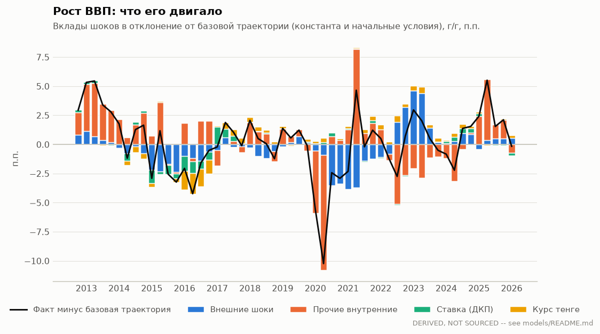

# BVAR с внешним блоком

Производный результат, не официальная статистика. Скрипт: `scripts/models/bvar.py`;
числа: `irf.csv` (все отклики с интервалами), `fevd.csv`, `historical_decomposition.csv`,
`forecast.csv`, `hyperparameters.csv`.

## Спецификация

- Переменные (квартальные, `model_data/quarterly.csv`): внешний блок — 100·ln Brent, ставка ФРС,
  100·ln RUB/USD; внутренний — 100·ln ВВП (SA, БНС), инфляция кв/кв в годовом выражении
  (400·Δln ИПЦ SA), TONIA, 100·ln USD/KZT. Инфляция, а не уровень ИПЦ: в 2011–2026 гг. логарифм
  уровня цен ведёт себя почти как I(2), и VAR в уровнях давал 84 % взрывных выборок.
- Выборка: 2011Q2–2026Q1 (60 кварталов; цепной ИПЦ начинается в 2011-01).
  Проверка устойчивости: с 2016Q1 (инфляционное таргетирование, плавающий курс).
- VAR(2) в уровнях; приор Миннесоты через фиктивные наблюдения (Bańbura, Giannone &
  Reichlin 2010): случайное блуждание, общая жёсткость λ, затухание по лагам 1/l, приор суммы
  коэффициентов μ. λ и μ выбраны по максимуму предельного правдоподобия на сетке (как у
  Giannone, Lenza & Primiceri 2015): **λ = 0.75, μ = 5**
  (устойчивость: λ = 0.5, μ = 25).
- Кризисные кварталы (2014Q1, 2014Q4, 2015Q3, 2015Q4, 2016Q1, 2020Q2, 2020Q3) входят с дисперсией шоков, умноженной на s²
  (Lenza & Primiceri 2022); s выбран вместе с λ и μ: **s = 5**, выигрыш
  лог-правдоподобия против s = 1: 90.9. Без этого TONIA 2015–2016 гг. (15–37 %)
  делает ставку почти неперсистентной, и прогноз TONIA падает на 5 п.п. за квартал.
- Блочная экзогенность: лаги казахстанских переменных исключены из уравнений внешнего блока
  (малая открытая экономика). Апостериорное распределение — Гиббс (SUR), 1000 сохранённых
  выборок; отброшено взрывных выборок: 176.
- Идентификация — рекурсивная в указанном порядке: внешний блок → ВВП → курс → инфляция →
  TONIA. Внешние шоки первыми; курс переносится в цены уже внутри квартала (высокая доля
  импорта в потреблении); ставка реагирует на всё в том же квартале (как в 2014–2015 и 2022 гг.),
  а шок ДКП — это движение TONIA сверх этой реакции. Проверка: порядок «… инфляция → TONIA →
  курс» (курс реагирует на всё, но в цены попадает лишь с лагом) — столбец «Курс последним».
  Интервалы — 16–84 перцентили.

## Ключевые отклики (медиана [16 %; 84 %])

| Показатель | Базовая, 2011Q2–2026Q1 | Курс последним | Без масштаба (s = 1) | С 2016Q1 |
|---|---|---|---|---|
| ВВП через 4 кв., % — нефть +10 % | 0.11 [-0.16; 0.37] | 0.11 [-0.16; 0.37] | 0.43 [0.18; 0.70] | 0.34 [-0.09; 0.76] |
| Уровень цен через 8 кв., % — нефть +10 % | 0.71 [0.36; 1.12] | 0.71 [0.36; 1.12] | -0.10 [-0.41; 0.27] | 0.47 [-0.14; 1.12] |
| USD/KZT через 1 кв., % — нефть +10 % | -0.38 [-0.92; 0.15] | -0.38 [-0.92; 0.15] | -1.72 [-2.35; -1.01] | 0.05 [-0.47; 0.60] |
| ВВП через 4 кв., % — TONIA +1 п.п. | -0.12 [-0.26; 0.03] | -0.11 [-0.26; 0.03] | -0.16 [-0.29; -0.04] | -0.31 [-0.78; 0.16] |
| Уровень цен через 8 кв., % — TONIA +1 п.п. | -0.18 [-0.37; -0.03] | -0.22 [-0.40; -0.06] | -0.20 [-0.33; -0.08] | 0.60 [0.04; 1.19] |
| USD/KZT через 1 кв., % — TONIA +1 п.п. | 0.02 [-0.14; 0.17] | -0.28 [-0.56; 0.02] | -0.06 [-0.25; 0.11] | -0.40 [-0.73; -0.07] |
| Перенос курса в цены за 1 кв. | 0.04 [-0.01; 0.08] | 0.02 [0.00; 0.03] | 0.17 [0.14; 0.19] | 0.06 [0.02; 0.10] |
| Перенос курса в цены за 4 кв. | 0.11 [0.04; 0.19] | 0.08 [0.03; 0.12] | 0.24 [0.17; 0.33] | 0.23 [0.10; 0.37] |
| Перенос курса в цены за 8 кв. | 0.19 [0.09; 0.31] | 0.14 [0.07; 0.22] | 0.29 [0.18; 0.44] | 0.78 [-0.19; 2.19] |
| ВВП через 4 кв., % — USD/KZT +10 % | -0.06 [-0.57; 0.47] | -0.12 [-0.58; 0.35] | -0.46 [-1.07; 0.10] | 0.15 [-0.75; 0.95] |

Уровень цен — накопленный отклик инфляции (сумма кв/кв SAAR / 4). Перенос курса = отклик
уровня цен / отклик USD/KZT на шок курса на том же горизонте.

Главное (базовая спецификация):

- **Перенос курса** за 4 кв. — 0.11, за 8 кв. — 0.19. Без
  масштабирования кризисных кварталов он 2.2 раза выше: высокий
  перенос — свойство крупных девальваций 2014–2015 гг., а не «обычных» колебаний курса.
- **Шок ДКП** +1 п.п. TONIA: уровень цен через 8 кв. -0.18 %, ВВП через 4 кв.
  -0.12 %. Эффект на цены значим на уровне 68 %, но мал (вероятные причины —
  долларизация и льготное кредитование; модель их не проверяет).
- **Нефть** +10 %: ВВП через 4 кв. +0.11 %, уровень цен через 8 кв.
  +0.71 %, тенге укрепляется на 0.38 % через квартал. Без
  масштабирования эффект нефти на курс и ВВП завышается — его «делают» 2014–2015 гг.

## Декомпозиция дисперсии ошибки прогноза, % (медиана)

| Переменная | Горизонт, кв. | Внешние шоки | Прочие внутренние | Ставка (ДКП) | Курс тенге |
|---|---|---|---|---|---|
| ВВП | 4 | 15 | 77 | 1 | 0 |
| ВВП | 8 | 16 | 72 | 2 | 1 |
| ВВП | 20 | 21 | 61 | 2 | 2 |
| USD/KZT | 4 | 17 | 5 | 1 | 69 |
| USD/KZT | 8 | 26 | 7 | 1 | 56 |
| USD/KZT | 20 | 44 | 5 | 1 | 37 |
| Инфляция (кв/кв, SAAR) | 4 | 31 | 60 | 1 | 3 |
| Инфляция (кв/кв, SAAR) | 8 | 37 | 52 | 2 | 3 |
| Инфляция (кв/кв, SAAR) | 20 | 41 | 48 | 1 | 4 |
| TONIA | 4 | 19 | 27 | 45 | 2 |
| TONIA | 8 | 32 | 22 | 36 | 4 |
| TONIA | 20 | 52 | 14 | 23 | 4 |

«Прочие внутренние» — шоки уравнений ВВП и ИПЦ (спрос/предложение без разделения).

## Историческая декомпозиция

Вклады групп шоков в темп роста г/г (Fry–Pagan: выборка, ближайшая к медианным откликам,
чтобы вклады складывались точно).

## Безусловный прогноз (медиана [16 %; 84 %])

| Квартал | ВВП, г/г, % (лог.) | ИПЦ, г/г, % (лог.) | TONIA, % | USD/KZT |
|---|---|---|---|---|
| 2026Q2 | 3.1 [1.6; 4.5] | 10.3 [9.6; 10.8] | 16.6 [14.9; 18.4] | 497 [481; 512] |
| 2026Q3 | 3.8 [1.8; 5.7] | 9.9 [8.7; 11.0] | 15.5 [13.3; 17.7] | 500 [475; 525] |
| 2026Q4 | 2.5 [-0.3; 4.8] | 10.0 [8.1; 11.7] | 14.8 [12.5; 17.1] | 503 [472; 536] |
| 2027Q1 | 3.4 [0.3; 6.2] | 9.9 [7.5; 12.1] | 14.4 [11.9; 16.8] | 507 [469; 543] |
| 2027Q2 | 3.6 [0.6; 6.2] | 9.7 [7.1; 12.3] | 14.1 [11.7; 16.7] | 510 [467; 554] |
| 2027Q3 | 3.6 [0.8; 6.5] | 9.6 [6.9; 12.4] | 14.0 [11.6; 16.7] | 513 [464; 565] |

## Как читать и чего модель не умеет

1. Рекурсивная идентификация — предположение, а не факт: шок ДКП — это движение TONIA,
   не объяснённое внешним блоком, ВВП и ИПЦ текущего квартала. До 2015 г. TONIA отражает
   ликвидность при фиксированном курсе, а не решения по базовой ставке; поэтому отклики на
   шок ДКП в полной выборке смешивают два режима — сравнивайте со столбцом «с 2016Q1».
2. Шок курса включает всё, что двигает тенге помимо нефти, ФРС и рубля (в т. ч. ожидания и
   операции Нацфонда); перенос — средний по выборке, он зависит от режима и размера шока.
3. 60 кварталов на 7 переменных — это данные, в которых приор играет большую роль: λ выбран
   по данным, но отклики на горизонте > 8 кварталов опираются на приор случайного блуждания.
4. Рекурсивная схема даёт «курсовую загадку»: после повышения ставки тенге в медиане слабеет
   (68 % интервал включает ноль на первых кварталах), а TONIA на ударе снижается при
   ослаблении тенге. Типично для рекурсивной идентификации в малой открытой экономике
   (Kim & Roubini 2000); следующий шаг — знаковые ограничения.
5. Масштабирование кризисных кварталов — один общий множитель на заранее выбранный список
   кварталов; полноценная стохастическая волатильность — следующий шаг.
6. Выборка с 2016Q1 (41 квартал) даёт «ценовую загадку» (цены растут после повышения ставки)
   и положительный отклик ВВП на ослабление тенге — признак того, что данных мало для 7
   переменных; поэтому основной вариант — полная выборка с масштабированием кризисов.

## Предельное правдоподобие по сетке гиперпараметров

| λ | μ=0.5 | μ=1 | μ=2 | μ=5 | μ=10 | μ=25 | μ=100 |
|---|---|---|---|---|---|---|---|
| 0.05 | -1154.9 | -1154.1 | -1153.2 | -1152.7 | -1152.8 | -1153.1 | -1154.0 |
| 0.1 | -1149.9 | -1148.7 | -1147.0 | -1144.8 | -1144.1 | -1144.3 | -1145.4 |
| 0.15 | -1144.0 | -1142.6 | -1140.5 | -1137.9 | -1137.0 | -1137.2 | -1138.2 |
| 0.2 | -1139.0 | -1137.2 | -1134.9 | -1132.2 | -1131.6 | -1132.3 | -1133.3 |
| 0.3 | -1131.7 | -1129.6 | -1127.0 | -1124.2 | -1124.3 | -1126.6 | -1128.3 |
| 0.5 | -1124.8 | -1122.9 | -1120.0 | -1116.9 | -1117.6 | -1122.3 | -1127.2 |
| 0.75 | -1123.7 | -1122.4 | -1119.7 | -1116.1 | -1117.0 | -1123.3 | -1132.0 |
| 1.0 | -1126.5 | -1125.9 | -1123.5 | -1119.7 | -1120.5 | -1127.7 | -1139.5 |
| 1.5 | -1136.2 | -1136.7 | -1135.1 | -1131.3 | -1132.1 | -1140.0 | -1156.2 |
