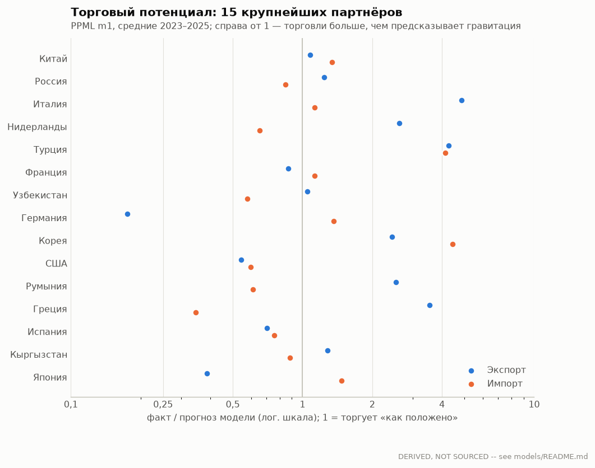
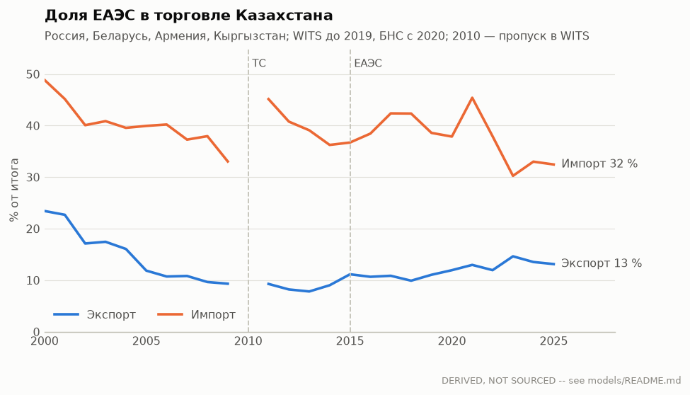

# Гравитационная модель торговли Казахстана (PPML)

Производный результат, не официальная статистика. Скрипт: `scripts/models/gravity.py`;
данные: `panel.csv` (панель), `coefficients.csv` (все оценки), `potential.csv` (потенциал).

## Данные

- Панель: 208 стран-партнёров × 2000–2025 (5312 наблюдений).
  Нулевые потоки сохранены: 43 % наблюдений по экспорту и 21 % по импорту.
- Потоки, тыс. → млн долл. США: WITS (Казахстан-репортёр) до 2019 г., БНС с 2020 г. WITS за
  2020–2022 не используется: импорт там неполный (2020 г.: 22 млрд $ против 39 млрд $ у БНС,
  Китай 2,0 против 6,4 млрд $); с 2023 г. источники совпадают до ~1 %. До 2020 г. итоги WITS
  совпадают с официальными (2019 г., экспорт: 58,1 против 57,7 млрд $).
- ВВП партнёра: WDI, текущие долл. США. Расстояние: CEPII `distw_harmonic` (взвешенное по
  населению). Граница, язык, ВТО, ЕС, соглашения: CEPII Gravity V202211 (после 2021 г. значения
  2021 г.). ЕАЭС задан явно: Россия и Беларусь с 2010 г. (Таможенный союз), Армения с 2015 г.,
  Кыргызстан с 2016 г. Тариф: применяемый Казахстаном средневзвешенный тариф к партнёру (WITS).

## Спецификации

- **PPML** (Santos Silva & Tenreyro 2006): Пуассон-ПМП на уровнях, нули не выбрасываются,
  устойчив к гетероскедастичности, из-за которой лог-линейный МНК смещён.
- **m1**: фиксированные эффекты года + ВВП партнёра и двусторонние издержки. Эффекты года
  поглощают всё со стороны Казахстана (ВВП, цены, курс, собственное многостороннее
  сопротивление).
- **m1 OLS**: то же на ln(поток) без нулей — эталон, показывающий смещение лог-линейной модели.
- **m2**: эффекты партнёра + года. Идентификация только по изменениям внутри партнёра (вход в
  ЕАЭС, ВТО, рост ВВП партнёра). Это основная спецификация для оценки политики. Дамми
  соглашения в m2 нет: внутри партнёра она не меняется (кроме перекодировок CEPII).
- **m3** (импорт): m2 + ln(1 + тариф). Коэффициент = −(σ − 1), торговая эластичность.
- Стандартные ошибки кластеризованы по партнёру; *** p<0,01, ** p<0,05, * p<0,1.

## Оценки

| Переменная | Эксп. PPML | Эксп. OLS | Эксп. PPML+FE | Имп. PPML | Имп. OLS | Имп. PPML+FE | Имп. +тариф |
|---|---|---|---|---|---|---|---|
| ln ВВП партнёра | 0.78*** (0.10) | 1.13*** (0.09) | 0.16 (0.14) | 0.96*** (0.05) | 1.37*** (0.06) | 0.63*** (0.13) | 0.60*** (0.10) |
| ln расстояния | -1.13*** (0.30) | -2.27*** (0.40) |  | -0.65** (0.27) | -1.07*** (0.26) |  |  |
| Общая граница | 0.80* (0.46) | 0.46 (1.05) |  | 0.92*** (0.34) | 0.89 (0.57) |  |  |
| Русский — официальный язык | -0.22 (0.47) | -1.11 (1.05) |  | -0.39 (0.49) | -0.72 (0.89) |  |  |
| Бывший СССР | -0.02 (0.33) | 2.12*** (0.60) |  | 1.27*** (0.22) | 2.63*** (0.29) |  |  |
| Торговое соглашение (ЗСТ СНГ и др.) | 0.79 (0.61) | 1.15 (0.70) |  | 1.20*** (0.43) | 1.84*** (0.43) |  |  |
| ЕАЭС сверх ЗСТ | -0.24 (0.20) | -0.23 (0.49) | -0.07 (0.17) | 0.08 (0.23) | 0.23 (0.64) | -0.03 (0.09) | 0.16** (0.07) |
| Оба члены ВТО | 0.58 (0.46) | 0.50 (0.58) | 0.02 (0.54) | 0.64* (0.33) | 0.56 (0.44) | -0.14 (0.10) | -0.17* (0.10) |
| ЕС | 1.27*** (0.46) | 1.84*** (0.54) |  | 0.65*** (0.24) | 1.95*** (0.30) |  |  |
| ln(1 + тариф РК) |  |  |  |  |  |  | 3.26 (2.27) |
| Наблюдений | 5310 | 3002 | 4587 | 5310 | 4192 | 5259 | 2617 |
| Fit (корр.² / R²) | 0.53 | 0.52 | 0.92 | 0.95 | 0.69 | 0.97 | 0.97 |

Эффекты дамми в процентах = exp(β) − 1. Главное:

- **ЕАЭС сверх ЗСТ СНГ (m2, внутри партнёра):** экспорт -7 %
  (95 % ДИ -33…+30 %), импорт -3 % (95 % ДИ -18…+15 %). Таможенный союз и ЕАЭС
  не добавили торговли сверх того, что уже давали зона свободной торговли СНГ, ВВП партнёров и
  общие для года шоки: коэффициенты незначимы. Это согласуется с долей ЕАЭС в импорте:
  37–41 % в 2002–2008 гг. и 36–45 % в 2011–2022 гг. (см. график). Идентификация — по четырём странам, где
  доминирует Россия; 2010 г. для России и Беларуси исключён (разрыв в данных WITS).
- **Тариф (m3):** β = 3.26 (s.e. 2.27, p = 0.15) — торговая
  эластичность **не идентифицирована**, знак не тот, что предсказывает теория (σ − 1 ≈ 4–6,
  Head & Mayer 2014). Причина в данных: при эффектах года тариф РНБ, общий для всех партнёров
  без преференций, поглощается; остающаяся разница между партнёрами в средневзвешенном тарифе —
  это состав импорта (в каких товарах партнёр специализирован), а не политика. Преференции
  (нулевой тариф ЕАЭС/СНГ) уже учтены дамми. Для σ нужны тарифы и потоки на уровне HS-6.
- **ВВП и расстояние (m1):** эластичности (экспорт 0.78 и -1.13, импорт 0.96
  и -0.65) близки к «каноническим» 1 и −1 лишь отчасти. Это ожидаемо для
  одностороннего набора: многостороннее сопротивление партнёров не контролируется, а экспорт —
  в основном нефть, идущая по трубопроводам в конкретные страны независимо от их размера.
- **PPML против OLS:** OLS даёт другие коэффициенты при расстоянии и ВВП — это смещение
  из-за гетероскедастичности и потерянных нулей, ради устранения которого нужен PPML.
- **RESET** (квадрат линейного индекса в m1): экспорт p = 0.82, импорт p = 0.02. Малое p — функциональная форма
  m1 неполна (ожидаемо без эффектов партнёра); для политики используйте m2/m3.

## Торговый потенциал (2023–2025, m1)

Факт / прогноз модели для 15 крупнейших партнёров. Выше 1 — торговли больше, чем «положено»
по размеру и расстоянию; ниже 1 — недоиспользованный потенциал (или барьер, не учтённый в модели).

| Партнёр | Экспорт, млн $ | факт/модель | Импорт, млн $ | факт/модель  |
|---|---|---|---|---|
| Китай | 14 918 | 1.08 | 16 542 | 1.34 |
| Россия | 9 336 | 1.24 | 18 323 | 0.84 |
| Италия | 16 379 | 4.87 | 1 266 | 1.13 |
| Нидерланды | 5 111 | 2.62 | 378 | 0.65 |
| Турция | 3 718 | 4.27 | 1 739 | 4.15 |
| Франция | 3 321 | 0.87 | 1 575 | 1.13 |
| Узбекистан | 3 147 | 1.05 | 1 290 | 0.58 |
| Германия | 1 069 | 0.17 | 3 039 | 1.36 |
| Корея | 1 998 | 2.43 | 2 110 | 4.44 |
| США | 1 505 | 0.54 | 2 317 | 0.60 |
| Румыния | 2 727 | 2.53 | 140 | 0.61 |
| Греция | 2 442 | 3.55 | 50 | 0.35 |
| Испания | 1 442 | 0.70 | 541 | 0.76 |
| Кыргызстан | 1 397 | 1.28 | 546 | 0.88 |
| Япония | 510 | 0.39 | 1 414 | 1.47 |

Чтение: экспорт в Италию, Нидерланды и другие страны Европы выше модели из-за нефти (КТК,
танкеры из Новороссийска), а не из-за торговой политики. Для диагностики несырьевого экспорта
нужна модель на товарных группах (HS), которой в репозитории пока нет.

## Ограничения

1. Один репортёр: нет многостороннего сопротивления партнёров, поэтому m1 — описательная
   модель, а не структурная (для структурной нужны потоки всех пар стран, например BACI).
2. Экспорт на две трети — нефть и газ; гравитация плохо описывает трубопроводную торговлю.
3. Разрыв источников в 2019/2020 (WITS → БНС) поглощается эффектами года только если он
   одинаков для всех партнёров; сверка 2023 г. (расхождение <1 %) это подтверждает для
   крупных партнёров.
4. Тариф — средневзвешенный, эндогенный; эластичность — нижняя граница.
5. Реэкспорт и «параллельный импорт» после 2022 г. (Россия) не выделяются.
